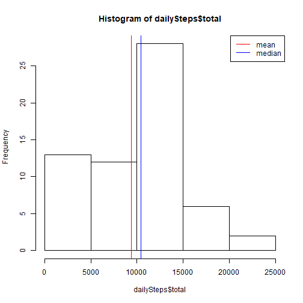
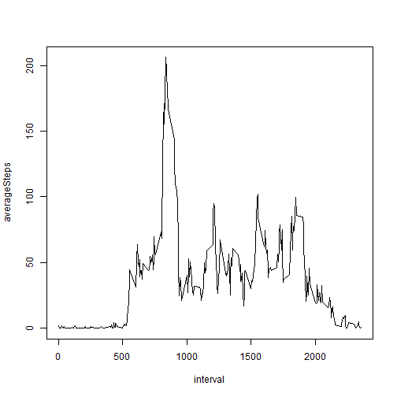
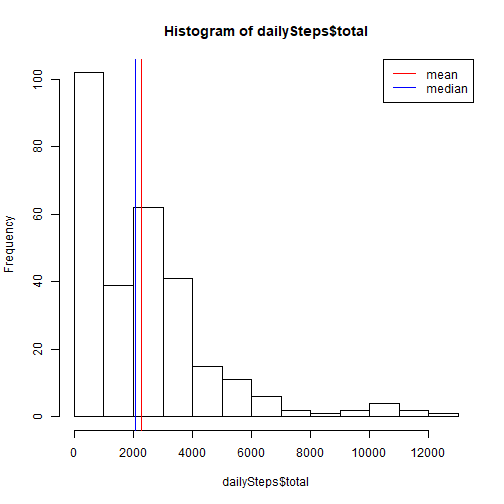

Course Project 1
================
### Reproducible Research


#### Loading and preprocessing the data
Show any code that is needed to

1. Load the data (i.e. read.csv())
2. Process/transform the data (if necessary) into a format suitable for your analysis


```r
file <- unzip("activity.zip")
data <- read.csv(file)
df <- data.frame(data)
head(df)
```

```
##   steps       date interval
## 1    NA 2012-10-01        0
## 2    NA 2012-10-01        5
## 3    NA 2012-10-01       10
## 4    NA 2012-10-01       15
## 5    NA 2012-10-01       20
## 6    NA 2012-10-01       25
```

```r
library(dplyr)
df <- group_by(df, date)
```

#### What is mean total number of steps taken per day?
For this part of the assignment, you can ignore the missing values in the dataset.

1. Make a histogram of the total number of steps taken each day
2. Calculate and report the mean and median total number of steps taken per day


```r
dailySteps <- summarize(df, total=sum(steps, na.rm=TRUE))
statistics <- summarize(dailySteps, mean=mean(total, na.rm=TRUE), median=median(total, na.rm=TRUE))
hist(dailySteps$total)
abline(v=statistics$mean, col="red")
abline(v=statistics$median, col="blue")
legend(x="topright", lty=1, col=c("red","blue"), legend=c("mean","median"))
```



```r
statistics
```

```
## # A tibble: 1 x 2
##    mean median
##   <dbl>  <int>
## 1 9354.  10395
```


#### What is the average daily activity pattern?

1. Make a time series plot (i.e. type = "l") of the 5-minute interval (x-axis) and the average number of steps taken, averaged across all days (y-axis)
2. Which 5-minute interval, on average across all the days in the dataset, contains the maximum number of steps?


```r
df <- group_by(df, interval)
intervalAverages <- summarize(df, averageSteps=mean(steps, na.rm=TRUE))
with(intervalAverages, plot(interval, averageSteps, type='l'))
```



```r
intervalAverages[intervalAverages$averageSteps==max(intervalAverages$averageSteps),]
```

```
## # A tibble: 1 x 2
##   interval averageSteps
##      <int>        <dbl>
## 1      835         206.
```
Time interval 835 contains maximum nuber of steps on average (206). 

#### Imputing missing values
Note that there are a number of days/intervals where there are missing values (coded as NA). The presence of missing days may introduce bias into some calculations or summaries of the data.

1. Calculate and report the total number of missing values in the dataset (i.e. the total number of rows with NAs)

```r
sum(is.na(df$steps))
```

```
## [1] 2304
```

The dataset contains 2304 rows with missing values.

2. Devise a strategy for filling in all of the missing values in the dataset. The strategy does not need to be sophisticated. For example, you could use the mean/median for that day, or the mean for that 5-minute interval, etc.


We imputed missing step values with interval mean.

3. Create a new dataset that is equal to the original dataset but with the missing data filled in.


```r
write.table(df[,1:3], file="activity_imputed.csv", sep=",")
```

After running this code a file named "acitivity_imputed.csv" should recide in your working directory. The file contains the requested dataset.

4. Make a histogram of the total number of steps taken each day and Calculate and report the mean and median total number of steps taken per day. Do these values differ from the estimates from the first part of the assignment? What is the impact of imputing missing data on the estimates of the total daily number of steps?


```r
dailySteps <- summarize(df, total=sum(steps, na.rm=TRUE))
statistics <- summarize(dailySteps, mean=mean(total, na.rm=TRUE), median=median(total, na.rm=TRUE))
hist(dailySteps$total)
abline(v=statistics$mean, col="red")
abline(v=statistics$median, col="blue")
legend(x="topright", lty=1, col=c("red","blue"), legend=c("mean","median"))
```



```r
statistics
```

```
## # A tibble: 1 x 2
##    mean median
##   <dbl>  <dbl>
## 1 2280.  2081.
```
